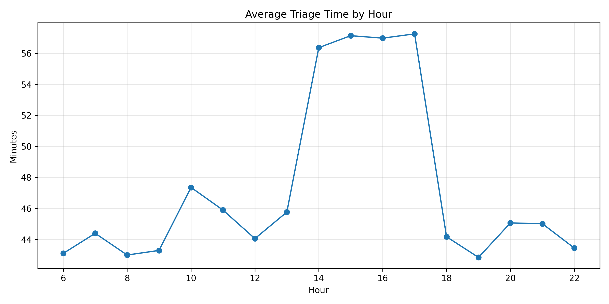
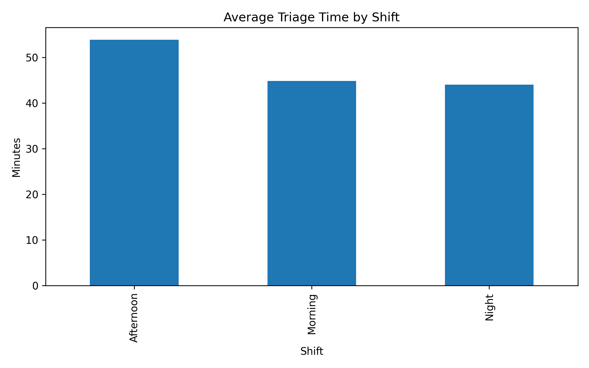
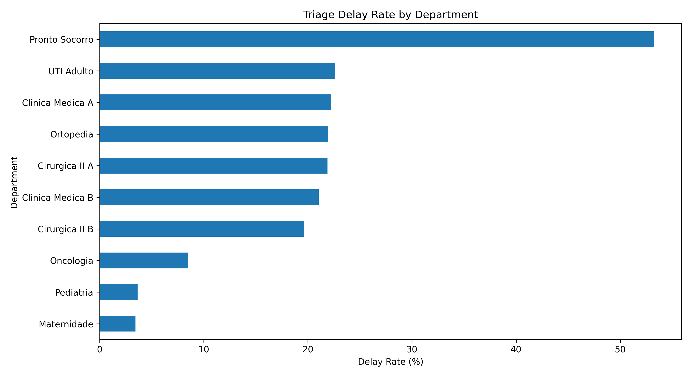
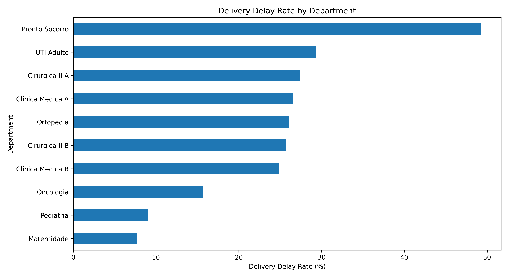
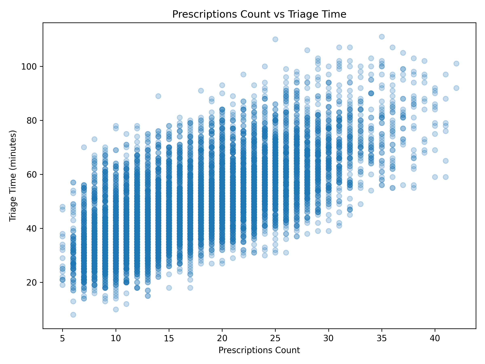
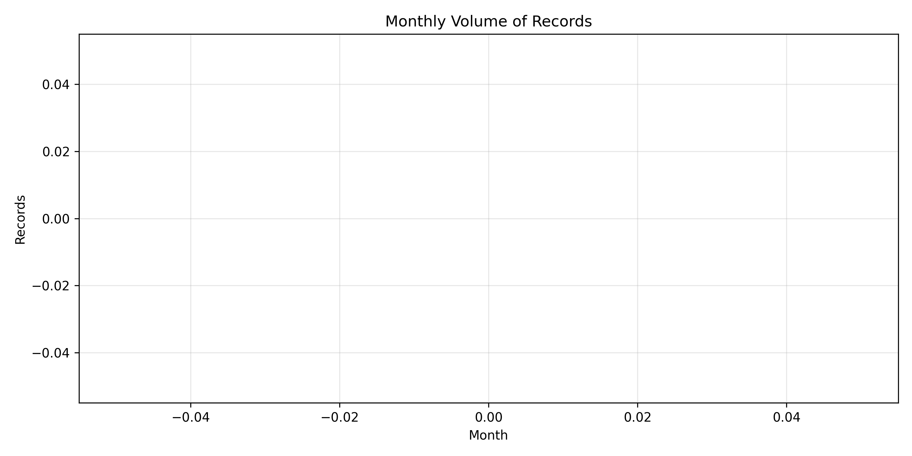

# Hospital Operations Analysis

## Executive Summary

This project analyzes one year of hospital pharmacy operations (10,266 records) to identify bottlenecks in triage and medication delivery.

Delays are not random. They concentrate in the **afternoon shift**, driven mainly by **workload peaks rather than staffing levels**. The **Emergency Department (Pronto Socorro)** behaves as a critical outlier, with delay rates above 50%.

The results indicate a system with **high throughput (98.5% completion)** but **reduced responsiveness under pressure**, suggesting operation close to capacity limits.

---

## Dataset

* Period: 2025
* Records: 10,266
* Departments: 10
* Pharmacy units: 4

Includes:

* triage and delivery timestamps
* workload (prescriptions)
* staffing levels
* SLA targets and delay flags
* priority and operational context

---

## Key Metrics

* **Average triage time:** 49.34 min
* **Average delivery time:** 63.88 min
* **Triage delay rate:** 22.47%
* **Delivery delay rate:** 26.39%
* **Completion rate:** 98.50%

Interpretation:

* High completion ≠ good performance
* Delays indicate pressure on system responsiveness

---

## Core Findings

### 1. Delays are time-concentrated

* Peak: **17:00 (40.02% delay)**
* Critical window: **14:00–17:00**

This suggests workload accumulation and insufficient absorption capacity during peak hours.

---

### 2. Afternoon shift is the main bottleneck

| Shift     | Delay Rate |
| --------- | ---------- |
| Morning   | 12.79%     |
| Afternoon | **32.10%** |
| Night     | 11.07%     |

The issue is systemic:

* higher volume
* longer triage time
* longer delivery time

---

### 3. Emergency department is a structural outlier

* **Pronto Socorro: 53.23% delay rate**
* Highest triage time (62.54 min)

This reflects:

* unpredictable demand
* urgency variability
* workflow interruptions

Standard process assumptions do not fully apply here.

---

### 4. Workload drives delays more than staffing

* Prescriptions vs triage time: **0.69 (strong)**
* Pharmacists vs triage time: **-0.19 (weak)**

Interpretation:

* demand increase directly increases delay
* staffing adjustments are not enough to offset peaks

---

### 5. Throughput vs responsiveness gap

* Completion rate: **98.5%**
* Delay rate: **22–26%**

This is a classic near-capacity pattern:

* system delivers volume
* but loses speed and flexibility

---

## Operational Interpretation

The system is not inefficient. It is **overloaded in specific conditions**:

* peak hours (afternoon)
* high-demand departments (emergency)
* accumulated workload across the day

Delays emerge from **flow imbalance**, not isolated failures.

---

## Recommendations

1. **Rebalance staffing to match peak hours (afternoon)**
2. **Create differentiated workflow for Pronto Socorro**
3. **Monitor SLA by hour, not only overall performance**
4. **Introduce demand-smoothing strategies**
5. **Review prioritization logic under high load**

---

## Outputs

### Tables

* [Department Summary](./department_summary.csv)
* [Hour Summary](./hour_summary.csv)
* [Shift Summary](./shift_summary.csv)
* [Weekday Summary](./weekday_summary.csv)
* [Priority Summary](./priority_summary.csv)

### Visuals

* 
* 
* 
* 
* 
* 

---

## Tools

* Python (pandas, matplotlib)
* Operational KPI analysis
* Process performance evaluation

---

## References

* Hall, R. (2006). *Patient Flow: Reducing Delay in Healthcare Delivery*
* Toussaint & Berry (2013). Lean in healthcare
* Institute of Medicine (2001). *Crossing the Quality Chasm*
* WHO (2010). Health system performance indicators

---

## Final Note

This project shows that improving hospital performance is less about increasing output and more about **managing flow under peak conditions**.

Targeted adjustments in **time, demand, and process design** are likely to generate more impact than uniform resource increases.
